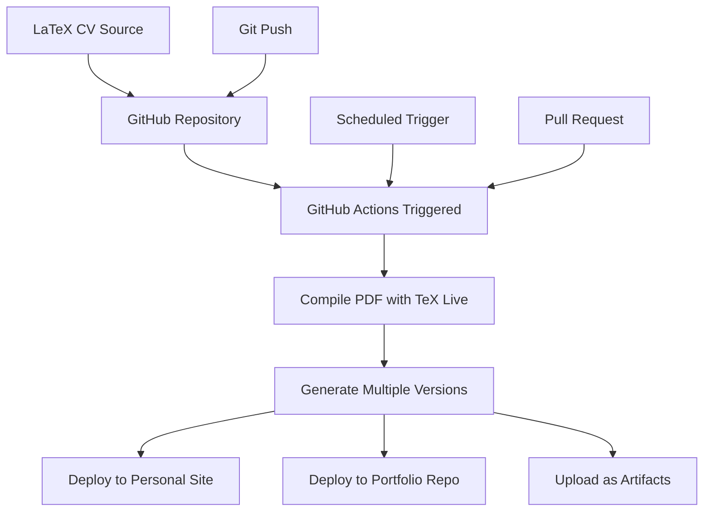

# Introduction

Tired of manually updating your CV across different platforms? Fed up with Word formatting breaking when you send it to someone? There's a better way. As software engineers, we should leverage the tools we know best: version control, automation, and infrastructure as code.

In this post, I'll show you how to build a fully automated CV pipeline using GitHub Actions, LaTeX, and the power of git. Your CV will be version-controlled, automatically compiled, and deployed to multiple destinations every time you make a change.

## The Problem with Traditional CV Management

Most people maintain their CVs in Word documents or Google Docs. This approach has several pain points:

- **No version control**: Hard to track changes or revert to previous versions
- **Format inconsistencies**: Documents look different across platforms and devices  
- **Manual distribution**: You need to manually update your CV on your website, LinkedIn, portfolio, etc.
- **Collaboration issues**: Sharing and reviewing changes is cumbersome
- **Limited automation**: No way to automatically generate different versions (resume vs full CV)

## The Solution: Infrastructure as Code for Your Career

The solution is treating your CV like any other software project. Here's what we'll build:



## Setting Up the Foundation

### 1. Choose Your CV Template

I'm using the [Awesome-CV](https://github.com/posquit0/Awesome-CV) LaTeX template, but you can use any LaTeX-based CV template. The key is having your CV source in a format that can be compiled programmatically.

Create a repository structure like this:

```
awesome-cv/
├── .github/
│   └── workflows/
│       └── compile-cv.yml
├── josemiguel443/
│   ├── cv.tex
│   ├── resume.tex
│   ├── coverletter.tex
│   └── Makefile
└── README.md
```

### 2. Create the Makefile

The Makefile handles the compilation logic:

```makefile
CC = xelatex
CV_DIR = josemiguel443
CV_SRCS = $(shell find $(CV_DIR) -name '*.tex')

.PHONY: all clean

all: $(foreach x, cv resume coverletter, $x.pdf)

%.pdf: $(CV_DIR)/%.tex $(CV_SRCS)
	$(CC) -output-directory=$(CV_DIR) $<

clean:
	rm -rf $(CV_DIR)/*.pdf
```

## The GitHub Actions Workflow

Here's the complete workflow that makes the magic happen:

```yaml
name: Compile PDFs
on:
  push: {}
  pull_request: {}
  schedule:
    - cron: "1 1 1 * *"  # Monthly rebuild

jobs:
  build:
    runs-on: ubuntu-latest
    strategy:
      matrix:
        files: [resume, cv, coverletter]
        include:
          - repo: JoseRodrigues443/JoseRodrigues443
            dir: ''
          - repo: JoseRodrigues443/joserodrigues443.github.io
            dir: static/files
    
    container: texlive/texlive:latest
    
    steps:
      - name: Checkout repo
        uses: actions/checkout@v3
        
      - name: Compile LaTeX documents
        run: make
        
      - name: Upload artifacts
        uses: actions/upload-artifact@v3
        with:
          name: josemiguel443
          path: josemiguel443/*.pdf
          
      - name: Deploy to multiple repositories
        uses: dmnemec/copy_file_to_another_repo_action@main
        env:
          API_TOKEN_GITHUB: ${{ secrets.API_TOKEN_GITHUB }}
        with:
          source_file: josemiguel443/${{ matrix.files }}.pdf
          destination_repo: ${{ matrix.repo }}
          destination_folder: ${{ matrix.dir }}
          user_email: 'josemiguel443@email.com'
          user_name: 'JoseRodrigues443'
          commit_message: 'Updated ${{ matrix.files }}'
```

## Breaking Down the Workflow

### Triggers

The workflow runs on three triggers:

- **Push events**: Every time you update your CV source
- **Pull requests**: For reviewing CV changes before merging
- **Scheduled runs**: Monthly rebuilds to ensure everything stays working

### Matrix Strategy

The matrix strategy is the secret sauce that makes this scalable:

```yaml
strategy:
  matrix:
    files: [resume, cv, coverletter]
    include:
      - repo: JoseRodrigues443/JoseRodrigues443
        dir: ''
      - repo: JoseRodrigues443/joserodrigues443.github.io
        dir: static/files
```

This configuration:
- Compiles three different document types
- Deploys each to multiple destination repositories
- Allows different target directories per destination

### Container-Based Compilation

Using `texlive/texlive:latest` as the container ensures:
- Consistent LaTeX environment across runs
- All necessary packages are available
- No need to install dependencies in each run

## Advanced Features

### Multiple Document Types

You can maintain different versions of your professional documents:

- **Resume**: Concise 1-2 page version for job applications
- **CV**: Comprehensive academic/research version
- **Cover Letter**: Template with placeholders for customization

### Automatic Distribution

The workflow automatically pushes your compiled PDFs to:
- Your GitHub profile repository (for the README)
- Your personal website's static files
- Any other repositories you specify

### Artifact Storage

GitHub Actions artifacts provide:
- Historical versions of your CV
- Easy download links for recruiters
- Backup storage for important documents

## Security Considerations

### Personal Access Token

You'll need to create a Personal Access Token with appropriate repository permissions:

1. Go to GitHub Settings > Developer settings > Personal access tokens
2. Generate a new token with `repo` scope
3. Add it as a secret named `API_TOKEN_GITHUB` in your repository

### Repository Permissions

Ensure your token has write access to all target repositories where you want to deploy your CV.

## Benefits of This Approach

### Version Control Everything

Every change to your CV is tracked in git. You can:
- See exactly what changed between versions
- Revert problematic changes easily
- Branch for different job applications
- Collaborate with mentors or career coaches

### Consistent Formatting

LaTeX ensures your CV looks identical everywhere:
- No font substitution issues
- Consistent spacing and layout
- Professional typography
- PDF output that prints correctly

### Zero-Effort Distribution

Once set up, your CV automatically appears everywhere:
- Personal website gets updated
- GitHub profile stays current  
- Portfolio repositories stay in sync
- Artifacts are available for download

### Scalable Architecture

Adding new destinations is trivial:
- Just add entries to the matrix
- No code changes required
- Supports different file naming conventions

## Real-World Usage Tips

### Branching Strategy

Create branches for different purposes:
```bash
git checkout -b job-application/company-name
# Customize for specific role
git checkout -b academic/conference-2024
# Academic version for conference applications
```

### Custom Variables

Use LaTeX variables for easy customization:
```latex
\newcommand{\targetcompany}{Awesome Tech Corp}
\newcommand{\targetrole}{Senior Software Engineer}
```

### Integration with Other Tools

This workflow integrates well with:
- **Notion**: Export job applications with links to your CV
- **LinkedIn**: Reference your always-current CV URL
- **Email signatures**: Include a link to your latest CV

## Troubleshooting Common Issues

### LaTeX Compilation Errors

Check the GitHub Actions logs for specific LaTeX errors. Common issues:
- Missing packages (add to your LaTeX preamble)
- Encoding problems (ensure UTF-8)
- Font issues (verify font availability in the container)

### Permission Denied Errors

Verify:
- Your personal access token has the right permissions
- Target repositories exist and you have write access
- The destination directory exists or can be created

### Artifact Upload Failures

Ensure:
- PDF files were generated successfully
- Paths in the workflow match your directory structure
- Artifact names are unique and valid

## Conclusion

Building a CI/CD pipeline for your CV might seem overkill, but it's a perfect example of applying software engineering principles to personal productivity. You get version control, automation, consistent formatting, and effortless distribution.

The initial setup takes a few hours, but you'll save countless hours over your career. More importantly, your CV will always be current, professional, and available wherever you need it.

Your career deserves the same engineering rigor as your code. Start treating your CV like the critical infrastructure it is.

## Next Steps

Want to take this further? Consider these enhancements:

- **Multi-language support**: Generate CVs in different languages
- **A/B testing**: Maintain different CV versions and track their performance
- **Integration testing**: Verify your CV renders correctly across different PDF viewers
- **Automated job application**: Combine with job board APIs for automatic applications

The foundation is there. Build on it to create a career management system that works as hard as you do.

## License

Copyright 2016-present [Miguel Rodrigues](https://joserodrigues443.github.io).

Released under the [GPL 3](https://github.com/JoseRodrigues443/joserodrigues443.github.io/blob/master/LICENSE) license.