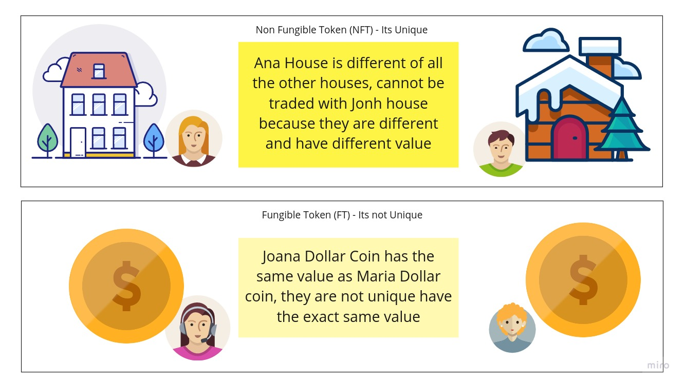
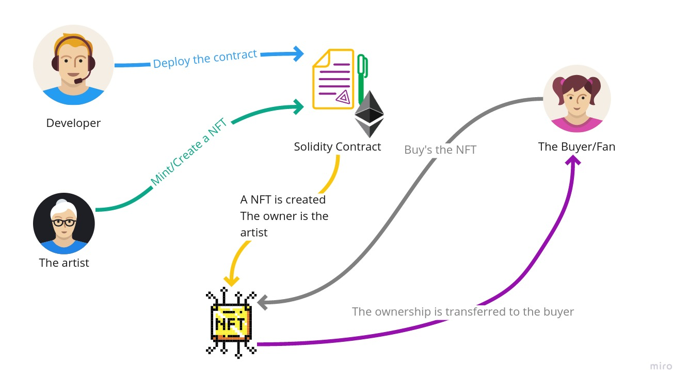
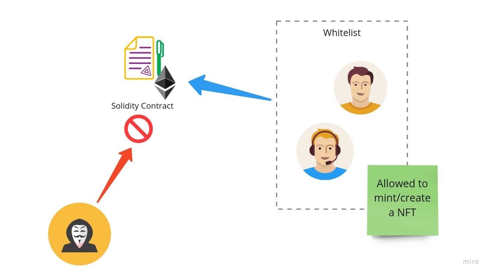
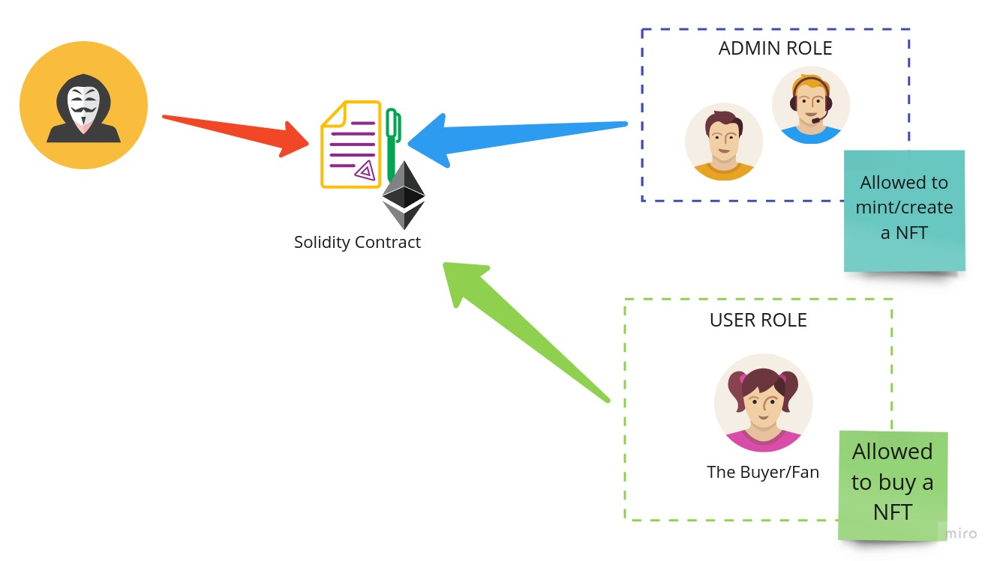

# Introduction

- [Introduction](#introduction)
  - [First... What is a NFT?](#first-what-is-a-nft)
  - [How can I create and use a NFT?](#how-can-i-create-and-use-a-nft)
  - [Why should I secure it?](#why-should-i-secure-it)
  - [Show me the code man](#show-me-the-code-man)
    - [Requirements](#requirements)
    - [Create a base project](#create-a-base-project)
    - [Create the contracts](#create-the-contracts)
      - [Implement Role Access System](#implement-role-access-system)
      - [Implement the NFT contract](#implement-the-nft-contract)
  - [How do how I know it works? Testing to the rescue](#how-do-how-i-know-it-works-testing-to-the-rescue)
    - [Lets test](#lets-test)
  - [Concluding](#concluding)
  - [License](#license)

This post provides the notion on how to create a NFT that can be deployed and used on multiple blockchain networks by multiple people, but at the same time add a security feature that makes sure that only authorized personal can use the complex features of the NFT.

## First... What is a NFT?

A NFT is a Non-fungible token, so its a representation that something that is unique on the blockchain. They can be owned by someone, and no one can alter that ownership without permission (or a transfer).

It can be anything:

- a image
- a video
- a concert ticket
- any legal document that can be signed
- a deed for a house



## How can I create and use a NFT?

To first create and use a NFT we need have a base contract, a contract is the set of rules, data store and implementation of the logic that we want to have in our program.



## Why should I secure it?

It really depends on the objective of your Contract, if you want a Contract that the community can use freely, don't secure it.

But imagine that you are a artist, and you have a concert or a gig in the next months. You can sell tickets as unique tokens (NFT's) that after the event are collectible's that can be so so valuable in the future. If the contract is not secure everyone can create your concert NFT, those fakes in the market will decrease how valuable and useful your Tokens are.

So how can you secure your NFT's? You can create your own security implementation, for example a whitelist where only the users in that whitelist can access the contract features. In the following image you can see how it would work.



The advantage of this implementation is its simplicity, for example you create a list of allowed addresses (user addresses in the blockchain) like this: `mapping(address => bool) whitelist;`. Then you check if the sender of the request is in the whitelist, like this `require(whitelist[msg.sender]);`, if the message sender is in the required check does not fail and the transaction is possible.

But there is a problem with this "simple" solution... First everyone has the same access in this whitelist,  the artist has the same access as the intern, if we want to have different access level's then a role based system would need to be implemented

## Show me the code man

You can see the entire project [this repository :fire: JoseRodrigues443/ownable-nft-contract-solidity](https://github.com/JoseRodrigues443/ownable-nft-contract-solidity) :fire:, but we are going to analyse it step by step.

### Requirements

- NodeJS (setup [instruction's here](https://nodejs.org/en/))
- Hardhat tooling (setup [instruction's here](https://hardhat.org/tutorial/setting-up-the-environment.html))

### Create a base project

There are multiple projects and tools that allow use to compile contracts in solidity, to deploy the contracts and create unit tests that allow us to make sure everything is fine... Today we are going to use [HardHat](https://hardhat.org/tutorial/creating-a-new-hardhat-project.html).

```bash

  # Setup basic npm project
  mkdir project
  cd project
  npm init
  npm install --save-dev hardhat

  # Start project, select the typescript option for a type safe language (we are not savages)
  npx hardhat

```

### Create the contracts

```bash

  # Contract that haves and manages a user and admin Role
  touch contracts/RoleControl.sol
  # the ERC 721 contract that uses the *RoleControl* contract access control logic
  touch contracts/ConcertNFT.sol

```

#### Implement Role Access System

We could create our own access control system... But lets be honest, would that be safe or practical?
Because of that we are going a fully tested and community supported contract called [AccessControl.sol](https://github.com/OpenZeppelin/openzeppelin-contracts/blob/master/contracts/access/AccessControl.sol) from [OpenZeppelin](https://github.com/OpenZeppelin).



In solidity we can call the Github solidity file directly, but the link can break in the future, is better to install it locally using `npm install @openzeppelin/contracts`.

Edit the *RoleControl.sol* contract:

```javascript
// SPDX-License-Identifier: GPL3     <-- ADD YOUR LICENSE HERE (MIT; GPL3; etc)
// The version of the Solidity language to use
pragma solidity ^0.8.0;

// Import the OpenZeppelin AccessControl contract
import "@openzeppelin/contracts/access/AccessControl.sol";

// create a contract that extends the OpenZeppelin AccessControl contract
contract RoleControl is AccessControl {
  // We can create as many roles as we want
  // We use keccak256 to create a hash that identifies this constant in the contract
  bytes32 public constant USER_ROLE = keccak256("USER"); // hash a USER as a role constant
  bytes32 public constant INTERN_ROLE = keccak256("INTERN"); // hash a INTERN as a role constant

  // Constructor of the RoleControl contract
  constructor (address root) {
    // NOTE: Other DEFAULT_ADMIN's can remove other admins, give this role with great care
    _setupRole(DEFAULT_ADMIN_ROLE, root); // The creator of the contract is the default admin

    // SETUP role Hierarchy:
    // DEFAULT_ADMIN_ROLE > USER_ROLE > INTERN_ROLE > no role
    _setRoleAdmin(USER_ROLE, DEFAULT_ADMIN_ROLE);
    _setRoleAdmin(INTERN_ROLE, USER_ROLE);
  }

  // Create a bool check to see if a account address has the role admin
  function isAdmin(address account) public virtual view returns(bool)
  {
    return hasRole(DEFAULT_ADMIN_ROLE, account);
  }

  // Create a modifier that can be used in other contract to make a pre-check
  // That makes sure that the sender of the transaction (msg.sender)  is a admin
  modifier onlyAdmin() {
    require(isAdmin(msg.sender), "Restricted to admins.");
      _;
  }

  // Add a user address as a admin
  function addAdmin(address account) public virtual onlyAdmin
  {
    grantRole(DEFAULT_ADMIN_ROLE, account);
  }

```

We just made the checks for the admin, but now you can create a check for all the other roles using the same logic.

So how can I use this contract? Very simple, we would extend the RoleControl contract (`contract X is RoleControl`). Then we you have a method that you want to protect just add the modifier like this:

```javascript

  // Only a account with admin role can access this
  function createNFT(address receiver, string memory uri) public onlyAdmin returns (uint256)
      {

```

#### Implement the NFT contract

Now that we have the tools to secure our NFT, lets create it.

Edit the *ConcertNFT.sol* contract:

```javascript

// SPDX-License-Identifier: GPL3
pragma solidity ^0.8.0;

// implements the ERC721 standard
import "@openzeppelin/contracts/token/ERC721/ERC721.sol";
import "@openzeppelin/contracts/token/ERC721/extensions/ERC721URIStorage.sol";
import "@openzeppelin/contracts/utils/Counters.sol";
// Logs are usefull
import "hardhat/console.sol";

// Use the previous contract
import "./RoleControl.sol";

contract ConcertNFT is ERC721, ERC721URIStorage, RoleControl {
  using Counters for Counters.Counter;
  Counters.Counter private _tokenIds;

  // events can be emitted, and used/read in unit tests
  // ideal to know what is happening
  event MintedWithRole(
    address from,
    address to,
    uint256 tokenId,
    string tokenURI,
    bool isAdmin
  );

  constructor() ERC721("ConcertNFT", "NFT") RoleControl(msg.sender) {
    console.log("Constructor: ConcertNFT created");
  }

  // Method that a NFT can be minted/Created from this contract
  function createNFT(address receiver, string memory uri) public
    onlyAdmin // only the admin
    returns (uint256)
  {
    _tokenIds.increment();

    uint256 newItemId = _tokenIds.current();
    _mint(receiver, newItemId);
    _setTokenURI(newItemId, uri); // uri is the file URI that can be seen in the market

    emit MintedWithRole(msg.sender, receiver, newItemId, uri, isAdmin(msg.sender));

    // returns the id for the newly created token
    return newItemId;
  }


```

Now we can use this contract, first we deploy this contract ([deploy example here](https://github.com/JoseRodrigues443/ownable-nft-contract-solidity/blob/main/scripts/deploy_ownable.ts)) and then we can call the mint method of that contract address ([you can see how to do it here](https://github.com/JoseRodrigues443/ownable-nft-contract-solidity/blob/main/scripts/mint.js)).

## How do how I know it works? Testing to the rescue

One of the difficulties of blockchain implementation is that after deploying a contract its code is on the blockchain for ever... So if you are going to do it, do it right a patch is not easy.

Of course there are solutions to this problem, for example using [Proxy Patters](https://docs.openzeppelin.com/upgrades-plugins/1.x/proxies) that allow the community to call the new versions.

Still the best way to avoid problems are with solid test batteries, that allows the developer to make sure that the contract does what is expected without problematic and dangerous edge cases.

What cases we want to test in this case?

We want to test all `RoleControl.sol` feature like:

- Add/Remove role
  - Does the caller haves permissions to make the call?
- IsAdmin/IsUser()
  - Does it protect methods with success?

We can do this tests using the [Chai.js](https://www.chaijs.com/) library, that integrates greatly with the [HardHat testing plugin.](https://hardhat.org/tutorial/testing-contracts.html)

### Lets test

1. Create the test file `touch test/roleControl.ts`
2. Setup the test env

```typescript

import { SignerWithAddress } from "@nomiclabs/hardhat-ethers/signers";
import { expect } from "chai";
import { ethers } from "hardhat";

describe("RoleControl", () => {

  let deployedContract: any;

  // Simulated accounts
  let owner: SignerWithAddress;
  let addr1: SignerWithAddress;
  let addr2: SignerWithAddress;
  let addr3: SignerWithAddress;

  // Setup the base env
  beforeEach(async function () {
    // Deploy the contract
    const Contract = await ethers.getContractFactory("RoleControl");
    [owner, addr1, addr2, addr3] = await ethers.getSigners();

    deployedContract = await Contract.deploy(owner.address);
    await deployedContract.deployed();
  });

```

Then we can have multiple test cases, for example the owner of the contract should be the admin, because in the constructor we do `_setupRole(DEFAULT_ADMIN_ROLE, root);`. To test that case we can do:

```typescript

  it("Owner should be admin", async () => {
    // after deploy the owner should be a admin
    expect(await deployedContract.isAdmin(owner.address)).to.be.equal(true);
    // and not a user
    expect(await deployedContract.isUser(owner.address)).to.be.equal(false);
  });

  // we can also check another user that is not the owner:
  it("Other user should not be admin", async () => {
    // addr1 is a random user that did not interacted with the deployment
    expect(await deployedContract.isAdmin(addr1.address)).to.be.equal(false);
    // he also is not registered as a user role
    expect(await deployedContract.isUser(addr1.address)).to.be.equal(false);
  });

```

## Concluding

Creating a smart contract allows for powerful interactions, however they can have have dangerous repercussions to an entire project. We this type of strategies we can better protect and control the usage of our dApps.

Hope this post helped, feel free to see the final product in my [Github JoseRodrigues443/ownable-nft-contract](https://github.com/JoseRodrigues443/ownable-nft-contract-solidity) and contact me using my page at [JoseRodrigues443.github.io](https://joserodrigues443.github.io/#home)

### Did you find this page helpful? Consider sharing it 🙌
