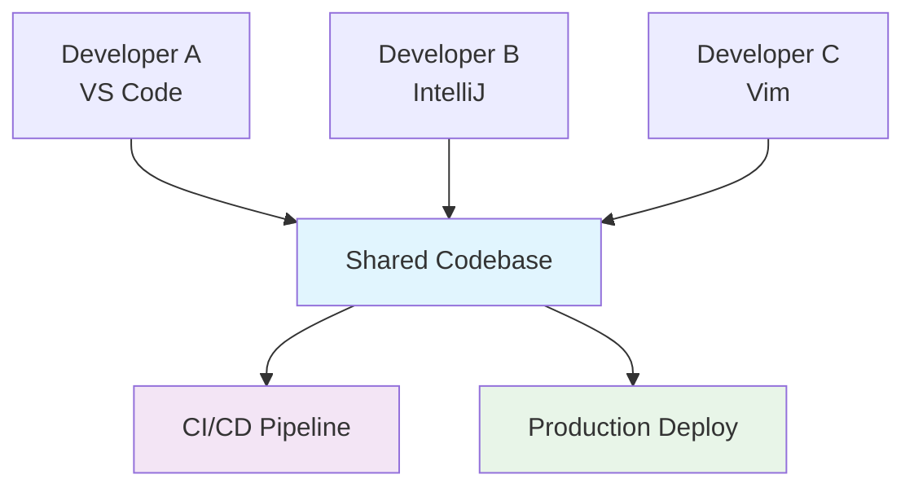

# Introduction

A codebase should be developed to be IDE-agnostic, meaning it should not rely on or depend on features of a specific integrated development environment (IDE). While IDEs provide useful tools and shortcuts for developers, a codebase should be able to be worked on using any text editor.

Developing an IDE-agnostic codebase provides more flexibility, control, and freedom for you and other developers. However, it requires forethought and discipline to avoid locking yourself into a particular IDE. Here are some tips for keeping your codebase portable across IDEs and text editors.

## Why IDE independence matters

Before diving into the technical aspects, let's understand why this approach is crucial:

- **Team flexibility**: Not everyone uses the same IDE. Your React developer might prefer VS Code while your backend engineer swears by IntelliJ
- **CI/CD compatibility**: Build servers don't run IDEs - they execute commands
- **Onboarding speed**: New team members can start contributing faster without IDE setup overhead
- **Tool evolution**: IDEs change, get discontinued, or become expensive. Your code should outlive any specific tool



# Use plain text files

Store your code in simple, human-readable plain text files, not proprietary formats tied to an IDE. Using standard text files in formats like `.txt`, `.java`, `.py`, etc. allows the code to be opened and edited in any text editor and prevents lock-in to a particular IDE.

## Examples of what to avoid:

```bash
# Bad - IDE-specific project files
MyProject.xcodeproj/
.idea/
.vscode/settings.json (with team-specific configs)

# Good - Standard project files
package.json
requirements.txt
Cargo.toml
go.mod
```

{}
While it's fine to have personal IDE configuration files, they should be in `.gitignore` and not part of the shared codebase.
{}

# Avoid IDE-specific features

Do not use special features that are specific to a particular IDE. For example, do not use IDE-specific keyboard shortcuts, code snippets, or templates. Do not create IDE-specific project files or folder structures. While these features may be convenient, they will not work outside of that IDE.

## Common IDE-specific anti-patterns:

### Code Generation
```java
// Bad - Relying on IDE code generation
@Data  // Lombok annotation that requires IDE plugin
public class User {
    private String name;
    // IDE generates getters/setters
}

// Better - Explicit, IDE-independent
public class User {
    private String name;
    
    public String getName() { return name; }
    public void setName(String name) { this.name = name; }
}
```

### Import Management

```python
# Bad - Relying on IDE to organize imports
import os, sys, json
from mypackage import *

# Good - Explicit imports that work everywhere
import json
import os
import sys

from mypackage.models import User
from mypackage.utils import validate_email
```

# Build and test from the command line

You should be able to build, compile, test, and run your code from the command line, without needing an IDE. Define your build process using a tool like Make, Maven, or Gradle and create a command-line interface. This ensures your code can be built anywhere, not just in an IDE.

## Example build configurations:

### Node.js project with package.json
```json
{
  "name": "my-project",
  "scripts": {
    "build": "webpack --mode production",
    "test": "jest",
    "test:watch": "jest --watch",
    "lint": "eslint src/",
    "start": "node dist/index.js",
    "dev": "webpack-dev-server --mode development"
  },
  "dependencies": {
    "express": "^4.18.0"
  },
  "devDependencies": {
    "jest": "^28.0.0",
    "webpack": "^5.70.0"
  }
}
```

### Python project with Makefile
```makefile
.PHONY: install test lint build clean

install:
	pip install -r requirements.txt
	pip install -r requirements-dev.txt

test:
	pytest tests/ -v --coverage

lint:
	flake8 src/
	black --check src/

build:
	python setup.py sdist bdist_wheel

clean:
	rm -rf build/ dist/ *.egg-info/
	find . -type d -name __pycache__ -delete
```

### Go project structure
```bash
# Project can be built with simple commands
go build ./cmd/myapp
go test ./...
go mod tidy
```

## Essential command-line workflows

Every project should support these basic operations from the terminal:

```bash
# Install dependencies
make install
# or: npm install, pip install -r requirements.txt, go mod download

# Run tests
make test
# or: npm test, python -m pytest, go test ./...

# Build the project
make build
# or: npm run build, python setup.py build, go build

# Start development server
make dev
# or: npm run dev, python manage.py runserver, go run main.go
```

# Use plain text for configuration

Use plain text files for any configuration, rather than IDE-specific config files. For example, use `.gitignore` files for source control rather than IDE-specific git options. Use plain text `.env` files rather than IDE-specific environment config.

## Configuration best practices:

### Environment Variables
```bash
# .env file (works with any tool)
DATABASE_URL=postgresql://localhost:5432/mydb
API_KEY=your-secret-key
DEBUG=true
PORT=3000
```

### Linting Configuration
```yaml
# .eslintrc.yml (works with any editor with ESLint support)
extends:
  - eslint:recommended
  - "@typescript-eslint/recommended"
rules:
  no-console: warn
  prefer-const: error
env:
  node: true
  es2021: true
```

### Docker Configuration
```dockerfile
# Dockerfile (ultimate IDE independence)
FROM node:16-alpine
WORKDIR /app
COPY package*.json ./
RUN npm install
COPY . .
RUN npm run build
EXPOSE 3000
CMD ["npm", "start"]
```

## Documentation as Code

Keep your project documentation in plain text formats:

```markdown
# README.md
## Getting Started

### Prerequisites
- Node.js 16+
- PostgreSQL 12+

### Installation
```bash
git clone https://github.com/yourname/project.git
cd project
npm install
cp .env.example .env
npm run build
npm start
```

### Development
```bash
npm run dev    # Start development server
npm test       # Run tests
npm run lint   # Check code style
```
```

# IDE-agnostic project structure

Here's what a well-structured, IDE-independent project looks like:

```bash
my-project/
├── .gitignore           # Version control config
├── .env.example         # Environment template
├── README.md           # Project documentation
├── package.json        # Dependencies and scripts
├── Dockerfile          # Containerization
├── docker-compose.yml  # Local development setup
├── Makefile           # Build automation
├── src/               # Source code
│   ├── index.js
│   ├── models/
│   └── utils/
├── tests/             # Test files
├── docs/              # Additional documentation
└── scripts/           # Build and deployment scripts
    ├── build.sh
    └── deploy.sh
```

# Real-world examples

Let's look at how popular projects maintain IDE independence:

## React Application
```json
{
  "scripts": {
    "start": "react-scripts start",
    "build": "react-scripts build",
    "test": "react-scripts test",
    "eject": "react-scripts eject",
    "lint": "eslint src/",
    "format": "prettier --write src/"
  }
}
```

## Go Microservice
```makefile
BINARY_NAME=myservice
BUILD_DIR=build

build:
	CGO_ENABLED=0 GOOS=linux go build -o ${BUILD_DIR}/${BINARY_NAME} ./cmd/server

test:
	go test -v ./...

lint:
	golangci-lint run

docker-build:
	docker build -t ${BINARY_NAME}:latest .

run:
	./${BUILD_DIR}/${BINARY_NAME}
```

{}
**Common Pitfall**: Don't rely on IDE-specific debugging configurations. Instead, provide clear instructions for debugging with standard tools or include debug flags in your application.
{}

# Conclusion

While IDEs offer useful features for developers, a codebase should not rely on or depend on an IDE. By using standard text files, avoiding IDE-specific features, enabling command-line building and testing, and using plain text for configuration, you can ensure your codebase is portable and IDE-agnostic.

This flexibility provides more freedom and control for you and any other developers working on the code. Keeping your codebase IDE-agnostic may require more discipline, but the benefits to your productivity and autonomy as a developer are worth it.

## Key takeaways:

- **Standardize on command-line workflows** - Every operation should be possible from the terminal
- **Use universal configuration formats** - JSON, YAML, TOML, and environment files work everywhere  
- **Document everything** - Clear README files and inline comments reduce onboarding friction
- **Automate with scripts** - Makefiles, package.json scripts, or shell scripts make complex operations simple
- **Test your approach** - Regularly try building and running your project in different environments

Remember: the goal isn't to avoid IDEs entirely, but to ensure your project doesn't *depend* on them. Developers should be free to use their preferred tools while the codebase remains accessible to everyone.

{}
**Pro tip**: Set up your CI/CD pipeline early. If your code builds and tests pass in a clean CI environment, you've achieved true IDE independence.
{}

## License

Copyright 2023-present [Miguel Rodrigues](https://joserodrigues443.github.io).

Released under the [GPL 3](https://github.com/JoseRodrigues443/joserodrigues443.github.io/blob/master/LICENSE) license.